# JARKOM-MODUL-1-2025-K45

## Member

| Nama                      | NRP        |
| ------------------------- | ---------- |
| Abhista Athallah Dyfan    | 5027251006 |
| Rifqi Dwi Muslim          | 5027251077 |

Host Lab: `10.4.89.247` — Prefix IP kelompok: `10.86.x.x`

## Laporan

1. Untuk mempersiapkan pembangunan The Wired, Lain yang berperan sebagai Router membuat tiga Switch/Gateway: Switch 1 menuju dua Entitas yaitu Alice dan Mika, Switch 2 menuju Chisa, sedangkan Switch 3 menuju Knights dan Eiri. Kelima Entitas tersebut dikonfigurasi sebagai Client di GNS3.

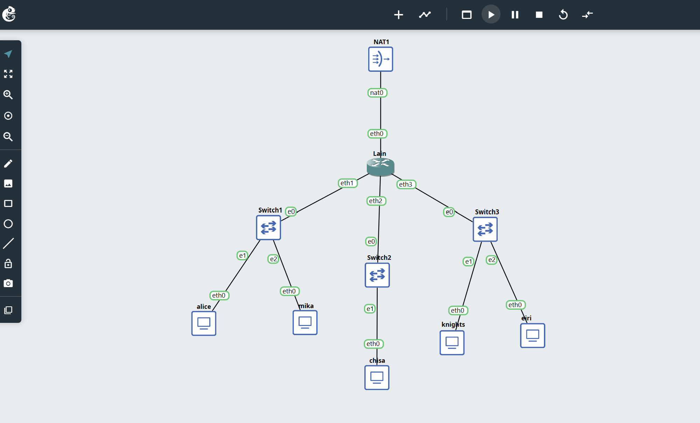

Topologi dibangun menggunakan image Docker `ardhptr21/alpinet:latest` (AlpiNet — Lightweight Alpine-based Networking Toolbox) untuk seluruh node, sesuai ketentuan modul. Node **NAT1** (bawaan GNS3) dipakai sebagai sumber internet publik, sedangkan **Lain** adalah node Docker terpisah dengan 4 adapter (eth0-eth3) yang berperan sebagai router Linux.

Rancangan pembagian IP (prefix `10.86.x.x`, /24 per switch):

| Perangkat | Interface | IP Address | Gateway | Keterangan |
| --------- | --------- | ---------- | ------- | ---------- |
| NAT1 | nat0 | (otomatis dari GNS3) | - | Sumber internet |
| Lain (Router) | eth0 | DHCP dari NAT1 | - | Uplink internet |
| Lain (Router) | eth1 | 10.86.1.1/24 | - | Gateway Switch 1 |
| Lain (Router) | eth2 | 10.86.2.1/24 | - | Gateway Switch 2 |
| Lain (Router) | eth3 | 10.86.3.1/24 | - | Gateway Switch 3 |
| alice | eth0 | 10.86.1.2/24 | 10.86.1.1 | Client Switch 1 |
| mika | eth0 | 10.86.1.3/24 | 10.86.1.1 | Client Switch 1 |
| chisa | eth0 | 10.86.2.2/24 | 10.86.2.1 | Server FTP, Switch 2 |
| knights | eth0 | 10.86.3.2/24 | 10.86.3.1 | Client Switch 3 |
| eiri | eth0 | 10.86.3.3/24 | 10.86.3.1 | Client Switch 3 |

Skema kabel: `NAT1 (nat0) → Lain (eth0)`, `Lain (eth1) → Switch1`, `Lain (eth2) → Switch2`, `Lain (eth3) → Switch3`, lalu Switch1 dihubungkan ke alice & mika, Switch2 ke chisa, Switch3 ke knights & eiri.


2. Karena menurut Lain pada saat itu The Wired masih terisolasi dari dunia luar, konfigurasikan router Lain agar dapat tersambung langsung ke jaringan internet publik melalui NAT/DHCP pada interface eth0.

Di terminal **Lain**, interface eth0 diminta mendapatkan IP secara dinamis dari NAT1 memakai `udhcpc` (Alpine tidak memakai `dhclient` bawaan Debian):

```sh
udhcpc -i eth0
ip link set eth0 up
```

Verifikasi hasilnya dengan:

```sh
ip a show eth0
```


Interface eth0 berhasil mendapat IP dari NAT1 (`192.168.122.233/24`), yang membuktikan Lain sudah punya jalur keluar ke internet publik.

3. Setelah router Lain terhubung ke internet, pastikan seluruh Entitas (Client) di bawah Switch 1, Switch 2, dan Switch 3 dapat saling terhubung dan berkomunikasi satu sama lain melalui konfigurasi routing.

Pasang IP statis untuk eth1, eth2, eth3 di Lain sebagai gateway tiap switch:

```sh
ip addr add 10.86.1.1/24 dev eth1
ip addr add 10.86.2.1/24 dev eth2
ip addr add 10.86.3.1/24 dev eth3
ip link set eth1 up
ip link set eth2 up
ip link set eth3 up

# aktifkan IP forwarding agar paket antar-subnet bisa diteruskan
sysctl -w net.ipv4.ip_forward=1
```

Sempat ditemukan kendala saat interface eth1-eth3 tidak ter-apply otomatis setelah restart (`inet6` link-local muncul, tapi `inet` static-nya tidak). Diperbaiki dengan bring-down/up ulang:

```sh
ifdown eth1 && ifup eth1
ifdown eth2 && ifup eth2
ifdown eth3 && ifup eth3
ip a
```


Ketiga interface berhasil mendapat IP sesuai rancangan: eth1 `10.86.1.1/24`, eth2 `10.86.2.1/24`, eth3 `10.86.3.1/24`.

Tes konektivitas antar-subnet dari alice:

```sh
ping -c 3 10.86.1.1    # ke gateway sendiri
ping -c 3 10.86.2.2    # ke chisa (subnet lain)
```

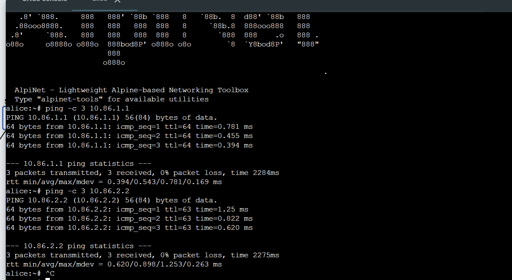

Ping ke gateway dan ke node di subnet lain berhasil (0% packet loss), membuktikan routing antar-Switch melalui Lain berfungsi.

4. Lain ingin agar setiap Entitas (Client) memiliki kemandirian di The Wired. Konfigurasikan firewall/iptables (NAT Masquerade) dan DNS resolver agar setiap Client dapat terhubung ke internet secara mandiri (dapat melakukan ping ke 8.8.8.8 dan membuka domain web google.com).

Pasang NAT Masquerade di Lain agar traffic dari subnet 10.86.x.x bisa keluar lewat eth0:

```sh
iptables -t nat -A POSTROUTING -o eth0 -j MASQUERADE
```

Tes dari alice, ping ke gateway → ping IP publik → ping domain:

```sh
ping -c 3 10.86.1.1
ping -c 3 8.8.8.8
ping -c 3 google.com
```

Ping ke gateway dan ke `8.8.8.8` berhasil, tetapi `ping google.com` gagal (`Try again`) — murni masalah resolusi DNS, bukan routing/NAT. Diperbaiki dengan menambahkan nameserver di tiap client:

```sh
echo "nameserver 8.8.8.8" > /etc/resolv.conf
```

Dijalankan di seluruh client (alice, mika, chisa, knights, eiri).

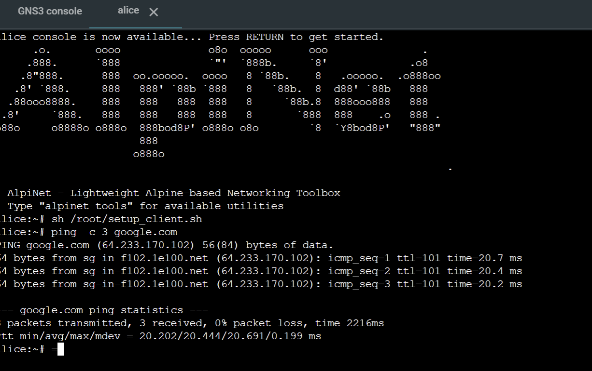

Setelah `resolv.conf` diperbaiki, `ping google.com` berhasil di semua client — setiap Entitas kini bisa terhubung ke internet secara mandiri.

5. Eiri tetap berupaya menanamkan kekacauan ke dalam jaringan. Untuk mengantisipasi restart tiba-tiba, pastikan seluruh konfigurasi jaringan tidak hilang saat semua node di-restart. Buat script verifikasi di `/root/cek_status.sh` pada router Lain yang menampilkan ringkasan interface (`ip -br a`) dan status tabel NAT (`iptables -t nat -L -v -n`) setelah reboot.

> ⚠️ **Bagian ini masih perlu dilengkapi** — belum ada bukti eksekusi (isi script, hasil `ip -br a`, dan `iptables -t nat -L -v -n` setelah reboot) yang tersedia. Berikut template script yang bisa langsung dipakai di Lain, tinggal dijalankan dan di-screenshot hasilnya:

```sh
cat << 'EOF' > /root/cek_status.sh
#!/bin/sh
echo "=== Ringkasan Interface ==="
ip -br a
echo ""
echo "=== Status Tabel NAT ==="
iptables -t nat -L -v -n
EOF
chmod +x /root/cek_status.sh
```

Jalankan setelah reboot node Lain untuk verifikasi:

```sh
/root/cek_status.sh
```

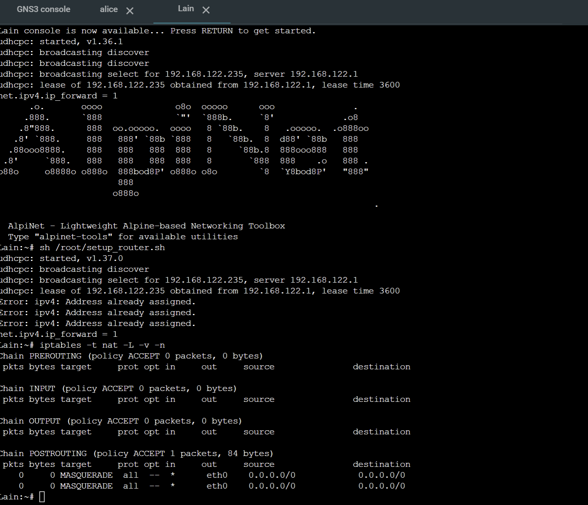

_(Isi bagian ini dengan hasil `ip -br a` dan `iptables -t nat -L -v -n` setelah node Lain direstart, untuk membuktikan konfigurasi jaringan tetap persisten.)_

6. Mika mencurigai adanya anomali traffic pada segmen jaringannya. Jalankan generator traffic berikut pada node Mika, lalu lakukan packet sniffing menggunakan Wireshark pada interface node Mika. Terapkan display filter khusus untuk menyaring paket yang berprotokol DNS atau ICMP. Tunjukkan screenshot hasil filter beserta ringkasan paket yang lolos.

Karena streaming capture Wireshark langsung dari GNS3 Web UI remote (`10.4.89.247`) tidak stabil (pipe streaming terputus, tampil `No Packets` terus-menerus), sniffing dilakukan langsung di dalam node mika memakai `tcpdump`, lalu file `.pcap` dipindahkan ke laptop untuk dibuka di Wireshark GUI sesuai instruksi soal.

Jalankan perekaman di background terlebih dahulu, baru trigger generator traffic-nya (kalau dijalankan berurutan tanpa background, prosesnya akan macet karena `tcpdump` mengunci terminal):

```sh
# Tab 1 - rekam paket
tcpdump -i eth0 -s 0 -w /root/hasil-capture.pcap &

# Tab 2 - jalankan generator traffic
bash /root/traffic_protocol7.sh
```

Setelah generator selesai, hentikan capture:

```sh
killall tcpdump
```

Saring paket ICMP atau DNS (port 53), dan hitung berapa yang lolos filter:

```sh
tcpdump -r /root/hasil-capture.pcap "icmp or port 53" -nn
tcpdump -r /root/hasil-capture.pcap "icmp or port 53" -nn | wc -l
```


Hasil: **52 paket tertangkap total**, **48 paket lolos filter** `icmp or port 53`.

File capture kemudian dipindahkan ke laptop via base64 (`base64 /root/hasil-capture.pcap` di mika → decode dengan `base64 -D` di terminal lokal) dan dibuka di Wireshark dengan display filter:

```
dns || icmp
```


**Ringkasan paket yang lolos filter:**
- **ICMP**: terlihat pasangan *Echo Request* dan *Echo Reply* antara mika (`10.86.1.3`) dengan resolver publik `8.8.8.8` dan `1.1.1.1`.
- **DNS**: terlihat *Standard Query* tipe A/AAAA untuk domain seperti `its.ac.id`, `github.com`, dan `google.com` ke port 53 resolver `8.8.8.8` dan `1.1.1.1`, beserta *Standard Query Response*-nya.

7. Chisa memutuskan mendirikan FTP Server pada node miliknya dengan shared folder di `/var/wired/data`. Terapkan kebijakan akses: user alice (hak akses read & write), user mika (dibatasi read-only), dan user eiri (dibatasi tanpa izin akses / blacklist). Buktikan konfigurasi dengan membuat file `signal_alice.txt` dari user alice, dan buktikan penolakan akses saat user eiri mencoba login.

Karena node chisa berbasis Alpine Linux, instalasi dan pembuatan user memakai `apk` dan `adduser` versi BusyBox (bukan `apt`/`useradd` seperti di Debian):

```sh
apk update
apk add vsftpd inetutils-ftp

mkdir -p /var/wired/data
chown -R alice:alice /var/wired/data
chmod 777 /var/wired/data

# buat user, home directory diarahkan ke shared folder
adduser -D -h /var/wired/data -s /bin/sh alice
echo "alice:password123" | chpasswd

adduser -D -h /var/wired/data -s /bin/sh mika
echo "mika:password123" | chpasswd

adduser -D -h /var/wired/data -s /bin/sh eiri
echo "eiri:password123" | chpasswd

# user sistem prasyarat vsftpd (wajib ada di Alpine)
id ftp || adduser -D -h /var/ftp -s /sbin/nologin ftp
```

Konfigurasi utama `/etc/vsftpd/vsftpd.conf`:

```
listen=YES
listen_ipv6=NO
anonymous_enable=NO
local_enable=YES
write_enable=YES
local_umask=022
dirmessage_enable=YES
xferlog_enable=YES
connect_from_port_20=YES

chroot_local_user=YES
allow_writeable_chroot=YES
local_root=/var/wired/data

user_config_dir=/etc/vsftpd/user_conf

userlist_enable=YES
userlist_file=/etc/vsftpd/userlist
userlist_deny=YES

seccomp_sandbox=NO
```

Aturan akses per user — alice diizinkan menulis, mika read-only, eiri diblacklist:

```sh
mkdir -p /etc/vsftpd/user_conf
echo "write_enable=YES" > /etc/vsftpd/user_conf/alice
echo "write_enable=NO"  > /etc/vsftpd/user_conf/mika
echo "eiri" > /etc/vsftpd/userlist

killall vsftpd 2>/dev/null
vsftpd /etc/vsftpd/vsftpd.conf &
netstat -tulpn | grep 21
```


Port 21 berstatus `LISTEN`, menandakan FTP server sudah aktif.

**Bukti alice (read & write)** — login lalu buat & upload `signal_alice.txt`:

```
ftp 10.86.2.2
Name: alice
Password: password123
ftp> !touch signal_alice.txt
ftp> put signal_alice.txt
226 Transfer complete.
ftp> ls
ftp> bye
```


**Bukti eiri (blacklist)** — login langsung ditolak:

```
ftp 10.86.2.2
Name: eiri
530 Permission denied.
Login failed.
```


8. Kelompok rahasia Knights perlu mengirimkan dokumen laporan intelijen ke FTP Server Chisa. Lakukan koneksi FTP client dari node Knights ke FTP Server Chisa menggunakan akun alice. Upload file berikut. Analisis sesi Wireshark dan sebutkan: perintah FTP untuk upload (STOR), kode status sukses server (226), dan port data TCP yang dinegosiasikan pada mode PASV.

Di node knights, siapkan file laporan dan mulai perekaman paket FTP di background sebelum melakukan koneksi:

```sh
apk add inetutils-ftp

cat << 'EOF' > /root/knights_upload.txt
==================================================
  KNIGHTS OF THE EASTERN CALCULUS — STATUS REPORT
  Protocol 7 Surveillance Network
  Classification: LEVEL 7 — EYES ONLY
==================================================
[isi laporan intelijen Knights]
--- END OF REPORT ---
Knights of the Eastern Calculus
"Let's all love Lain."
EOF

tcpdump -i eth0 -s 0 -w /root/ftp_traffic_pasv.pcap "tcp port 21 or (tcp[13] & 2 != 0)" &
```

Koneksi ke FTP chisa memakai akun **alice** (karena alice punya izin write), dengan mode PASV diaktifkan secara eksplisit:

```
ftp 10.86.2.2
Name: alice
Password: password123
ftp> passive
Passive mode: on
ftp> put /root/knights_upload.txt knights_upload.txt
226 Transfer complete.
ftp> ls
ftp> bye
```

```sh
killall tcpdump
```


File `.pcap` dipindahkan ke laptop (via base64) dan dibuka di Wireshark dengan filter `ftp`:


**Hasil analisis sesi Wireshark:**
- **Perintah upload**: `STOR knights_upload.txt`
- **Kode status sukses server**: `226 Transfer complete`
- **Port data TCP mode PASV**: dinegosiasikan lewat respons `227 Entering Passive Mode (h1,h2,h3,h4,p1,p2)`. Port dihitung dengan rumus `(p1×256)+p2` — contohnya bila respons berisi `(10,86,2,2,195,80)`, maka port data yang dipakai adalah `(195×256)+80 = 50000`.

Autentikasi FTP standar mengirim `USER alice` dan `PASS password123` dalam bentuk plain-text yang bisa langsung dibaca di capture — mengonfirmasi sifat FTP yang tidak terenkripsi.

9. Mika mengakses dokumen Protokol Tujuh dari FTP Server Chisa. Dari node Mika, unduh file tersebut menggunakan akun mika. Setelah itu, buktikan pembatasan read-only dengan mencoba mengunggah file baru dari akun mika, dan tunjukkan pesan error respon server (error 550 Permission denied) saat mika mencoba melakukan upload.

Dokumen "Protokol Tujuh" disiapkan lebih dulu di shared folder chisa (`/var/wired/data`):

```sh
# di terminal chisa
cd /var/wired/data
nano protokol_tujuh.txt   # isi dokumen ditulis manual
chmod 644 protokol_tujuh.txt
```

Dari terminal **mika**, siapkan file uji upload lalu koneksi ke FTP chisa:

```sh
apk add inetutils-ftp
echo "Uji coba upload dari Mika" > /root/test_mika.txt
```

```
ftp 10.86.2.2
Name: mika
Password: password123
ftp> passive
ftp> ls
ftp> get protokol_tujuh.txt
226 Transfer complete (1738 bytes received).
ftp> put /root/test_mika.txt test_mika.txt
550 Permission denied.
ftp> bye
```


**Hasil pengujian:**
- **Download (hak read)** — `get protokol_tujuh.txt` berhasil, server merespons `226 Transfer complete`, terverifikasi baik di mode standar maupun PASV.
- **Upload (pembatasan write)** — `put test_mika.txt` langsung ditolak server dengan `550 Permission denied`, membuktikan konfigurasi `write_enable=NO` pada `/etc/vsftpd/user_conf/mika` berjalan sesuai kebijakan akses read-only.

10. Knights melancarkan uji ketahanan koneksi ke server Chisa untuk menguji latensi jaringan The Wired. Kirimkan paket ping dari node Knights ke node Chisa dengan payload khusus 128 bytes dan interval 0.3 detik sebanyak 77 paket (`ping -c 77 -s 128 -i 0.3 <IP_Chisa>`). Buka Wireshark, catat nilai ICMP Type dan Code untuk Echo Request vs Echo Reply, serta analisis packet loss dan RTT (min/avg/max).

Dari node knights, capture ICMP dijalankan di background, lalu ping dikirim sesuai parameter soal:

```sh
tcpdump -i eth0 -w /root/ping77.pcap icmp &
ping -c 77 -s 128 -i 0.3 10.86.2.2
killall %1
```

```
--- 10.86.2.2 ping statistics ---
77 packets transmitted, 77 received, 0% packet loss, time 25664ms
rtt min/avg/max/mdev = 0.376/0.644/1.226/0.141 ms
```


Sample beberapa paket (untuk keperluan tampilan visual di Wireshark tanpa memindahkan capture 28KB penuh) diambil dan dipindahkan ke laptop via base64:

```sh
tcpdump -r /root/ping77.pcap -w /root/ping77_sample.pcap -c 5
base64 -w 0 /root/ping77_sample.pcap
```


**Hasil analisis:**

| Item | Nilai |
| --- | --- |
| ICMP Echo Request | Type **8**, Code **0** |
| ICMP Echo Reply | Type **0**, Code **0** |
| Packet loss | **0%** (77/77 paket diterima) |
| RTT min | 0.376 ms |
| RTT avg | 0.644 ms |
| RTT max | 1.226 ms |

Latensi rendah dan konsisten (rentang RTT hanya ~0.85 ms antara min-max) menunjukkan koneksi Knights–Chisa stabil tanpa indikasi congestion, meski dikirim 77 paket beruntun dengan payload 128 bytes dan interval ketat 0.3 detik.


11. Eiri membuktikan kelemahan protokol Telnet dengan membuat akun `phantom_user` (password `wired_ghost`) pada layanan `telnetd` di node Chisa, lalu login Telnet dari node Eiri ke Chisa sambil menangkap sesi di Wireshark. Tunjukkan kredensial plain-text lewat *Follow TCP Stream*, dan jelaskan mengapa tiap karakter terkirim dalam paket TCP terpisah.

Live capture dijalankan di GNS3 pada link **Switch2 Ethernet1 ↔ Chisa eth0**, lalu login Telnet dilakukan dari node Eiri (`10.86.3.3`) ke Chisa (`10.86.2.2`):

```sh
telnet 10.86.2.2
# login: phantom_user
# Password: wired_ghost
```

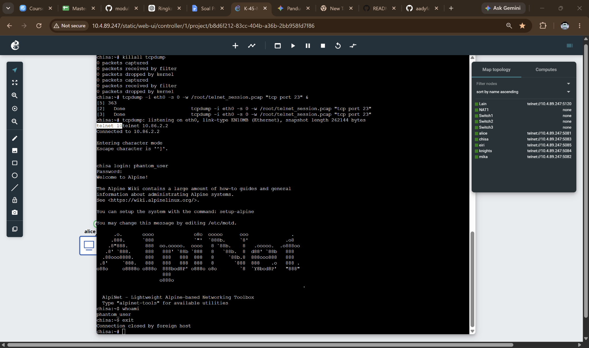

Filter Wireshark `telnet`, klik kanan salah satu paket → **Follow → TCP Stream**. Username `phantom_user` dan password `wired_ghost` terbaca utuh dalam plain-text, masing-masing karakter username tampil pada baris terpisah:

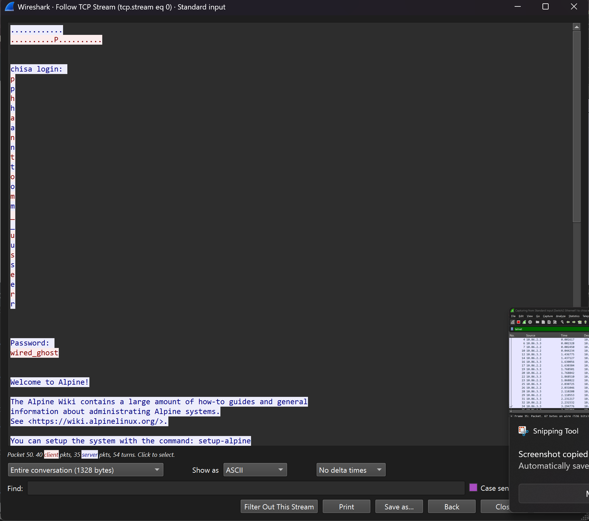

Lanjutan stream menunjukkan perintah `whoami` (membalas `phantom_user`) dan `exit`, juga terkirim karakter per karakter:

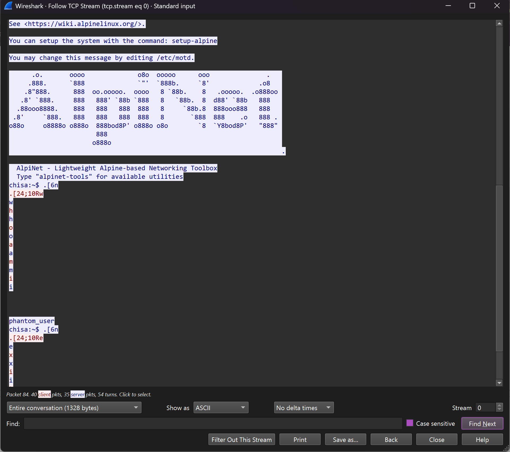

Daftar paket di Wireshark (filter `telnet`) mengonfirmasi setiap keystroke terkirim sebagai paket TCP tersendiri berukuran **1 byte data**, bergantian antara Chisa (`10.86.2.2`) dan Eiri (`10.86.3.3`):

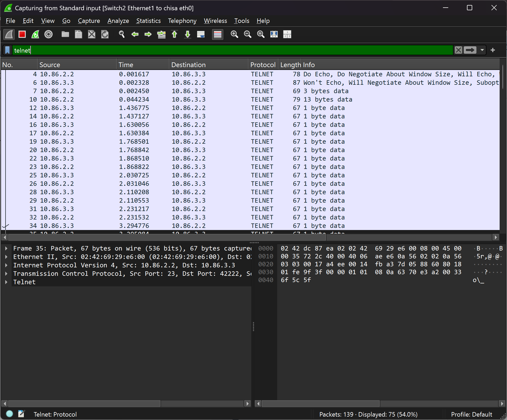

**Kredensial yang terbukti plain-text:** username `phantom_user`, password `wired_ghost`.

**Penjelasan mengapa tiap karakter terkirim dalam paket TCP terpisah:** Telnet secara default berjalan dalam mode *character-at-a-time* dengan *remote echo* — begitu satu tombol ditekan di client, karakter tersebut langsung dikirim sebagai satu paket TCP (terlihat di Wireshark sebagai "1 byte data"), dan server-lah yang bertugas meng-echo-kan karakter tersebut kembali ke layar client. Karena tidak ada buffering di sisi client, jumlah paket yang tertangkap sama persis dengan jumlah karakter yang diketik (termasuk saat mengetik username, password, maupun perintah `whoami`/`exit`), alih-alih terkirim sekaligus dalam satu paket berisi seluruh string.

> **Catatan validasi:** hasil capture sudah konsisten dan solid, filter `telnet` + Follow TCP Stream + kolom Length Info "1 byte data" adalah tiga bukti yang saling menguatkan satu sama lain untuk soal ini. Tidak ada yang perlu dikoreksi.

12. Alice mencurigai Knights menjalankan layanan rahasia. Lakukan pemindaian port dari Alice ke Knights menggunakan Netcat untuk memeriksa port 22 (SSH) dan 80 (HTTP) yang terbuka, serta port rahasia 7777 yang tertutup. Analisis perbedaan TCP flag antara port terbuka (SYN-ACK) dan port tertutup (RST-ACK) di Wireshark.

Live capture di GNS3 pada link **Switch3 Ethernet1 ↔ Knights eth0**, filter `tcp.port in (22, 80, 7777)`, lalu pemindaian dari node **Alice** (`10.86.1.2`) ke **Knights** (`10.86.3.2`):

```sh
nc -zv 10.86.3.2 22
nc -zv 10.86.3.2 80
nc -zv 10.86.3.2 7777
```

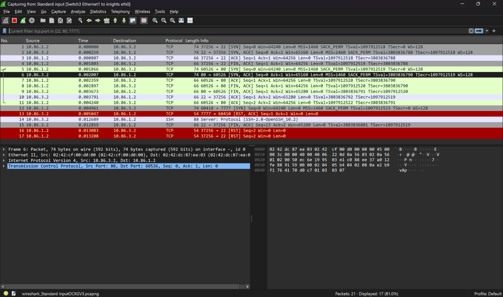

**Hasil pemindaian:**
- **Port 22 (SSH)**: `SYN → SYN, ACK → ACK → FIN, ACK` (*three-way handshake* penuh), Knights bahkan sempat mengirim banner `SSH-2.0-OpenSSH_10.2` sebelum ditutup — port terbuka dan aktif menjalankan SSH.
- **Port 80 (HTTP)**: pola identik, `SYN → SYN, ACK → ACK → FIN, ACK` — port terbuka.
- **Port 7777**: Alice mengirim `SYN`, Knights langsung membalas `RST, ACK` tanpa handshake lanjutan — port tertutup.

Detail flag paket `SYN, ACK` (port 22 terbuka):

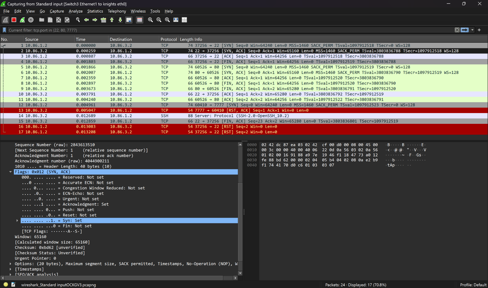

Detail flag paket `RST, ACK` (port 7777 tertutup) — bit *Reset* dan *Acknowledgment* keduanya set:

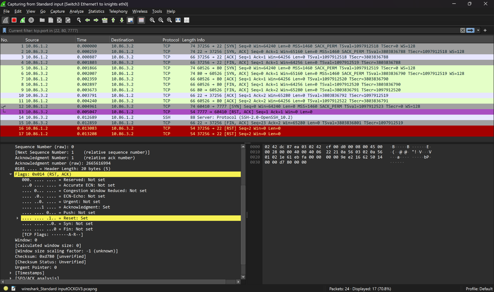

> **Catatan validasi:** hasil capture membuktikan persis seperti yang diprediksi secara teori: port terbuka membalas `SYN, ACK` lalu koneksi diselesaikan dengan `FIN, ACK`, sedangkan port tertutup langsung dijawab `RST, ACK` sekali tembak tanpa handshake. Layanan rahasia di port 7777 yang dicurigai Alice terbukti **tidak terbuka/tidak listening** saat pemindaian ini dilakukan. Metode dan filter yang dipakai sudah tepat, tidak ada koreksi.

13. Lain memerintahkan agar administrasi jarak jauh ke Knights memakai SSH tanpa password. Pasang OpenSSH server di Knights, buat pasangan kunci SSH di Mika untuk user `mika_admin`, konfigurasikan public key authentication (`PasswordAuthentication no`), lalu tangkap sesi koneksinya di Wireshark dan jelaskan mengapa kredensial tidak terlihat plain-text seperti pada Telnet.

Konfigurasi akun & kunci (Knights & Mika):

```sh
# di Knights
adduser -D -s /bin/sh mika_admin
echo "mika_admin:admin123" | chpasswd
sed -i 's/^#*PasswordAuthentication.*/PasswordAuthentication yes/' /etc/ssh/sshd_config
killall sshd && /usr/sbin/sshd

# di Mika
ssh-keygen -t rsa -b 2048
ssh-copy-id -o StrictHostKeyChecking=no mika_admin@10.86.3.2

# kembali di Knights, kunci akses password
sed -i 's/^#*PasswordAuthentication.*/PasswordAuthentication no/' /etc/ssh/sshd_config
sed -i 's/^#*PubkeyAuthentication.*/PubkeyAuthentication yes/' /etc/ssh/sshd_config
killall sshd && /usr/sbin/sshd
```

Bukti `ssh-copy-id` berhasil dan login berikutnya langsung masuk tanpa diminta password (public key authentication aktif):

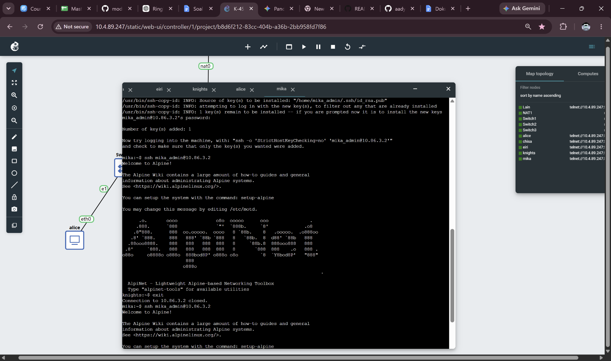

Live capture di GNS3 pada link **Switch1 Ethernet2 ↔ Mika eth0**, filter `ssh`. Sesi kedua (paket No. 111 dst.) menangkap handshake penuh dari awal:

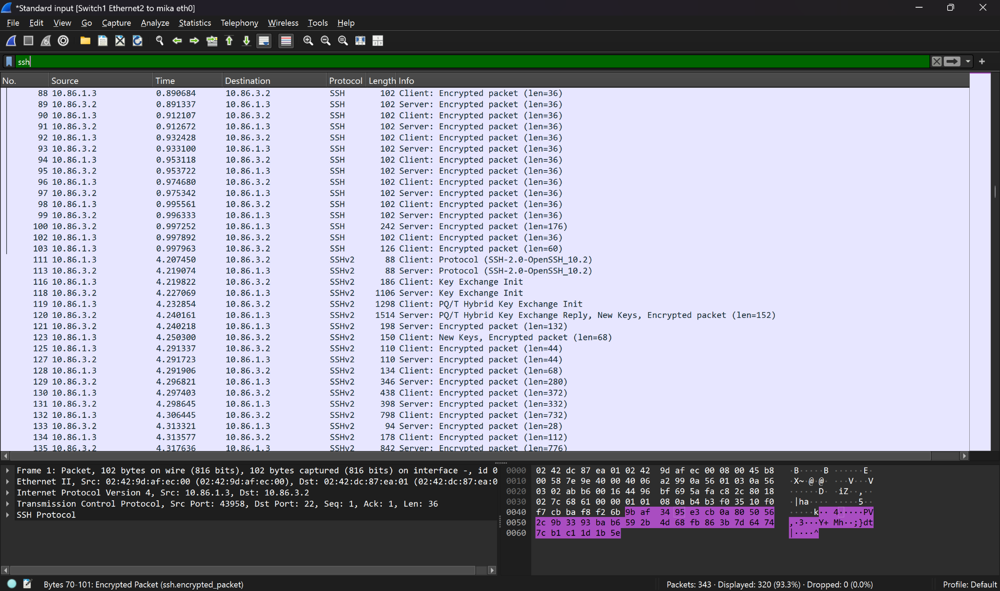

**Urutan handshake yang teridentifikasi:**
- **Protocol Version Exchange**: `SSH-2.0-OpenSSH_10.2` (client & server)
- **Key Exchange Init**: `SSH_MSG_KEXINIT` (client & server)
- **Key Exchange**: `PQ/T Hybrid Key Exchange Init` (client) → `PQ/T Hybrid Key Exchange Reply, New Keys, Encrypted packet` (server)
- **New Keys**: `New Keys, Encrypted packet` (client)
- Seluruh paket setelahnya berubah menjadi `Encrypted packet` hingga sesi selesai.

Seluruh sesi setelah handshake (termasuk otentikasi dan interaksi shell) tercatat sebagai `Encrypted packet` berukuran seragam ~102 byte:

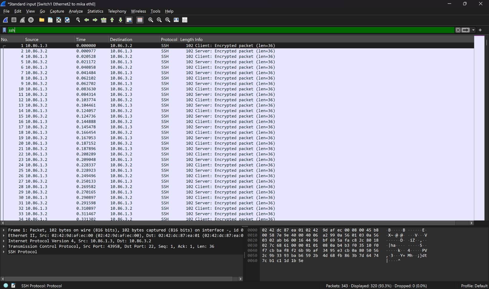

**Penjelasan mengapa kredensial tidak terlihat plain-text:** setelah pertukaran kunci selesai, Mika dan Knights sama-sama memperoleh *session key* yang identik tanpa pernah mengirim kunci itu sendiri secara langsung di jaringan. Seluruh komunikasi setelah titik ini (autentikasi public key maupun sesi shell) dibungkus sebagai `Encrypted packet`, sehingga meski disadap dengan Wireshark, isinya tidak bisa dibaca — berbeda total dengan Telnet yang mengirim setiap karakter (termasuk password) dalam bentuk plain-text.

> **Catatan validasi:** hasilnya benar dan lengkap, tapi ada satu detail yang meleset dari instruksi awal Gemini: mekanisme key exchange yang tertangkap di capture ini bukan `SSH_MSG_KEXDH_INIT`/`REPLY` (Diffie-Hellman klasik) seperti disebutkan sebelumnya, melainkan **`PQ/T Hybrid Key Exchange`** — algoritma *post-quantum hybrid* (gabungan Diffie-Hellman klasik dengan algoritma tahan-kuantum, umumnya `mlkem768x25519-sha256`) yang menjadi default di OpenSSH versi modern seperti `OpenSSH_10.2` yang dipakai node ini. Sebaiknya di laporan disebutkan nama paket yang **benar-benar muncul di capture** (`PQ/T Hybrid Key Exchange Init/Reply`), bukan istilah `KEXDH` lama, supaya sesuai dengan bukti screenshot.

14. Eiri melancarkan serangan brute-force terhadap form login web Alice. Analisis file capture `wired_bruteforce.pcapng` untuk mengidentifikasi attacker IP, target IP & port, password `lain_admin` yang berhasil ditembus, serta web server software & versinya. Validasi temuan ke socket server port `3401`.

Buka file di Wireshark, filter POST request:

```
http.request.method == "POST"
```

Terlihat ratusan percobaan POST ke `/login.php` dari IP yang sama:

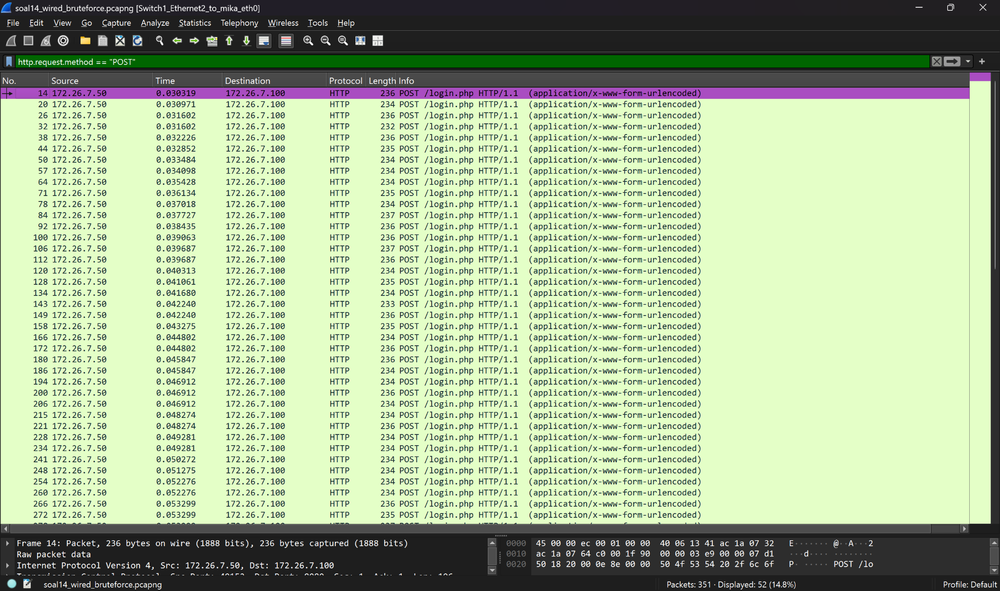

Diperluas dengan filter `http.request.method == "POST" || http.response`, ditemukan pola: hampir seluruh respons adalah `401 Unauthorized` (234 bytes), kecuali **paket No. 57** yang justru berupa `POST` baru — anomali ini menuntun ke satu respons `200 OK` (203 bytes, berbeda dari pola 401 di sekitarnya) sebagai penanda login berhasil:

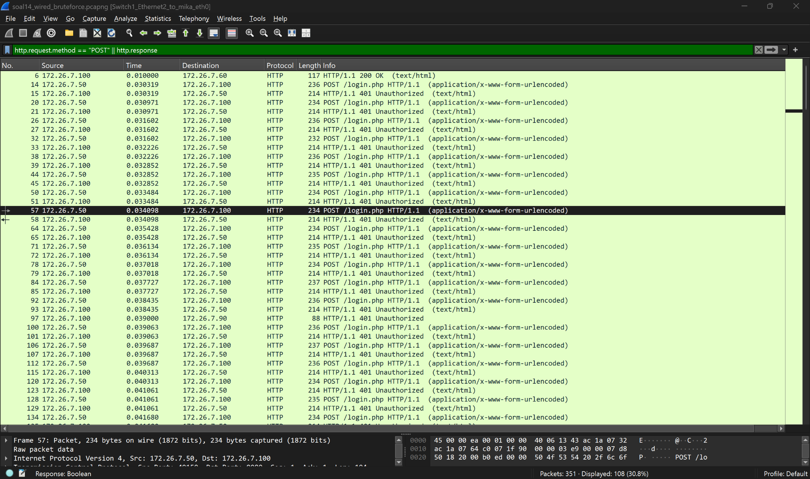

Klik kanan paket respons sukses → **Follow → HTTP Stream** (Stream #59):

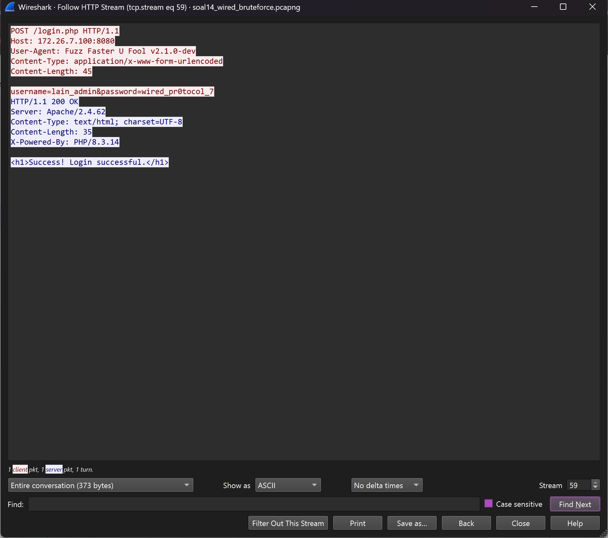

**Data hasil temuan:**

| Item | Nilai |
| --- | --- |
| Attacker IP | `172.26.7.50` |
| Target IP & Port | `172.26.7.100:8080` |
| Valid Username | `lain_admin` |
| Valid Password | `wired_pr0tocol_7` |
| Tool / User-Agent | `Fuzz Faster U Fool v2.1.0-dev` (ffuf) |
| Web Server Software & Version | `Apache/2.4.62` |
| Info tambahan | `X-Powered-By: PHP/8.3.14`, respons sukses `<h1>Success! Login successful.</h1>` |

Validasi ke socket server dari node **Lain** di GNS3:

```sh
nc 10.4.89.247 3401
```

Jawaban dimasukkan sesuai urutan pertanyaan (attacker IP → target IP:port → password → web server software) hingga keluar flag:

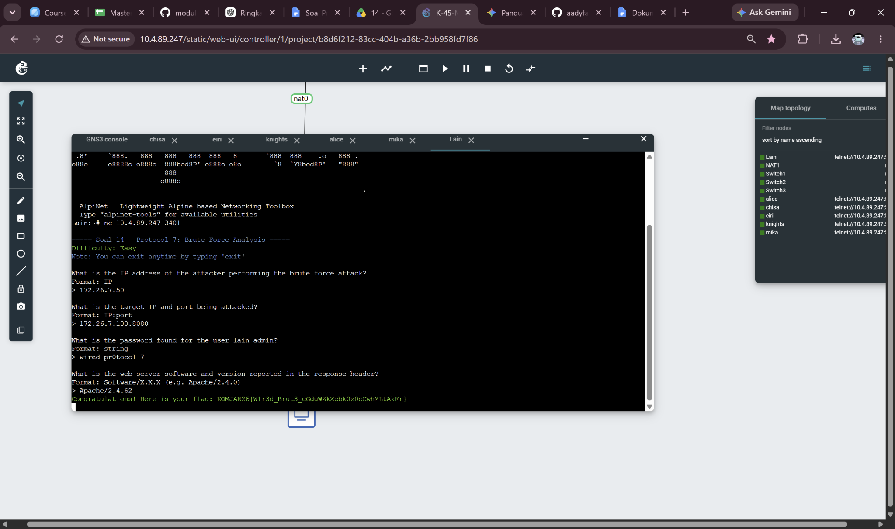

```
KOMJAR26{W1r3d_Brut3_cGduWZkXcbkOzOccwhMLtAkFr}
```

> **Catatan validasi:** sudah tuntas dan cocok 100% dengan hasil analisis Wireshark — attacker IP, target, password, dan versi web server yang dimasukkan ke socket semuanya sama persis dengan yang terbaca di HTTP Stream #59, dan server memang mengonfirmasi dengan mengeluarkan flag. Tidak ada yang perlu dikoreksi.

15. Eiri memasang perangkat keyboard USB berbahaya di node Alice. Buka file `wired_usb_hid.pcap`, identifikasi Vendor ID & Product ID perangkat USB dari deskriptornya, alamat nomor device USB, serta pesan rahasia yang berhasil dicuri dari keystroke. Validasi temuan ke socket server port `3402`.

> **Belum dieksekusi** — soal ini masih tahap perencanaan metode (belum ada capture/hasil nyata). Berikut kerangka langkah yang siap dipakai:

Ekstraksi payload HID interrupt data (`usb.capdata` atau `usbhid.data`) memakai `tshark`:

```sh
tshark -r wired_usb_hid.pcap -Y "usb.capdata || usbhid.data" -T fields -e usb.capdata -e usbhid.data > keystrokes.txt
```

Byte ke-0 (status modifier/Shift) dan byte ke-2 (HID keycode) tiap baris dipetakan lewat skrip Python parser untuk merekonstruksi pesan lengkap yang diketik korban.

_(Isi bagian ini dengan: Vendor ID & Product ID dari USB Device Descriptor — cek paket `GET DESCRIPTOR Response DEVICE` di Wireshark filter `usb.idVendor` / `usb.idProduct` —, alamat nomor device USB dari kolom `usb.device_address`, serta teks pesan hasil dekode keystroke.)_


Koneksi validasi ke socket server:

```sh
nc 10.4.89.247 3402
# atau: ncat 10.4.89.247 3402
```

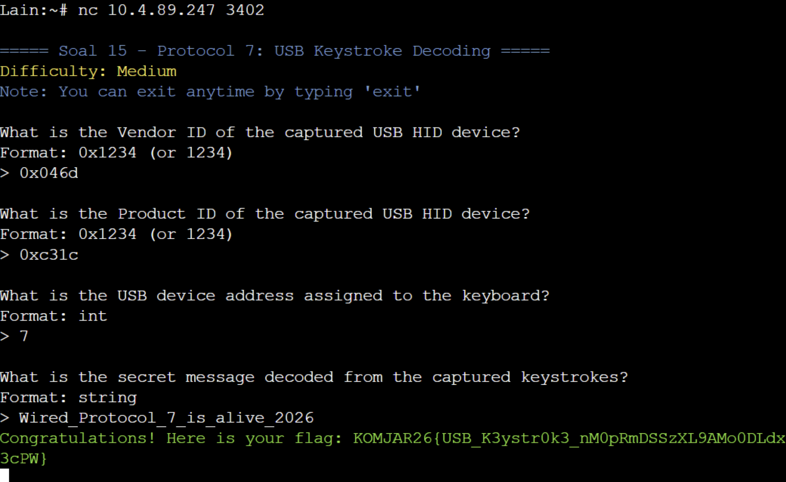

_(Isi bagian ini dengan flag yang keluar setelah Vendor ID, Product ID, device address, dan pesan hasil dekode dimasukkan.)_

> **Catatan validasi:** pendekatan ekstraksi `tshark` + parsing keycode benar secara prinsip untuk USB boot-protocol keyboard standar. Sebelum dijalankan, cek dulu di Wireshark: (1) field mana yang benar-benar terisi, `usb.capdata` atau `usbhid.data`; (2) mapping keycode di skrip mencakup semua tombol yang dipakai di pesan rahasia (kalau ada Tab/Esc/tanda baca di luar tabel, karakternya bisa diam-diam terlewat); (3) Vendor ID/Product ID/device address **tidak** ada di payload keystroke — harus dicari terpisah di paket USB Descriptor (biasanya di awal capture saat device pertama kali di-enumerate) dengan filter `usb.idVendor`, `usb.idProduct`, dan `usb.device_address`.
